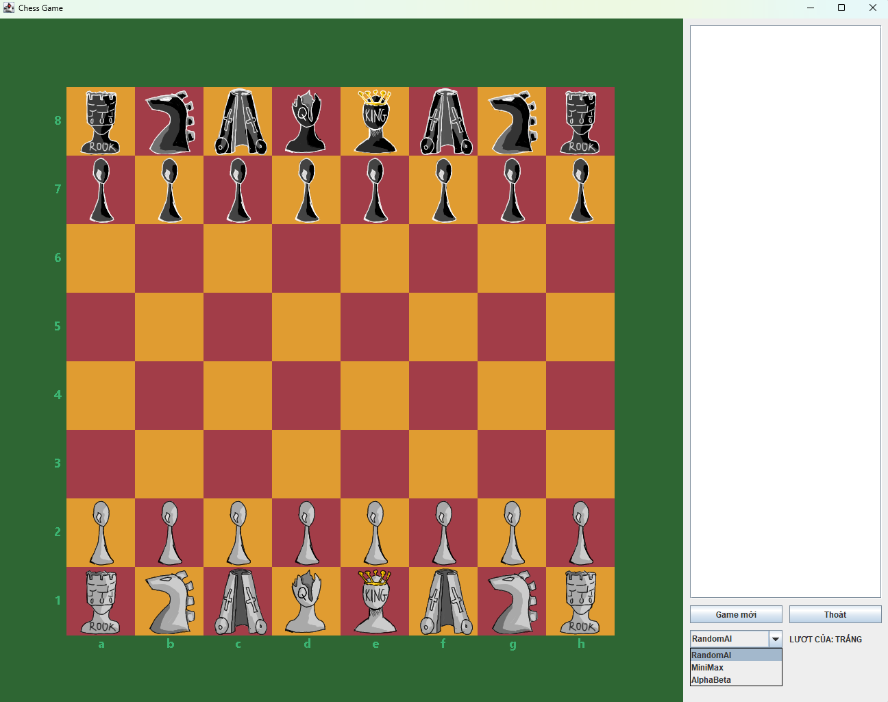
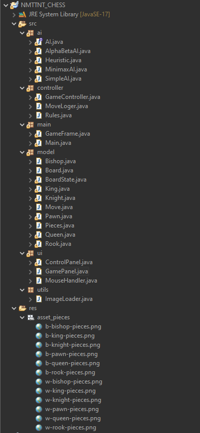
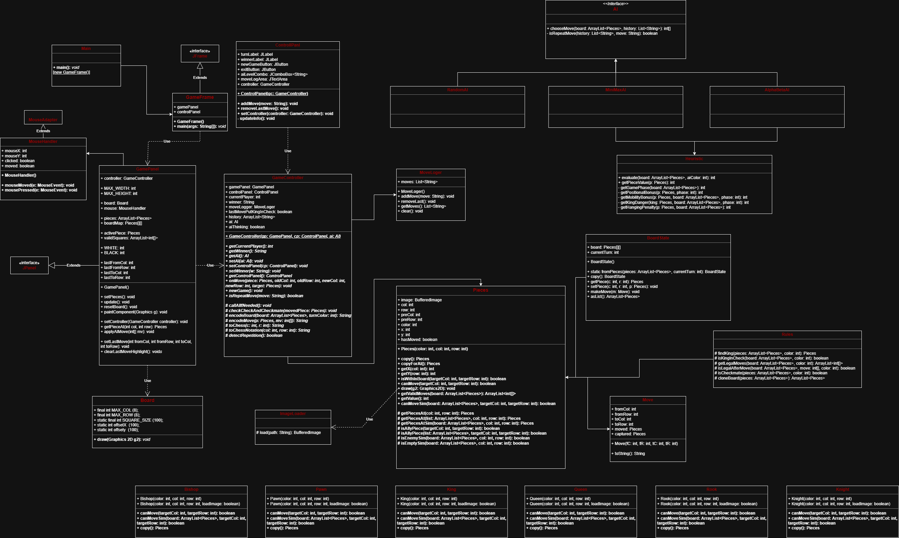
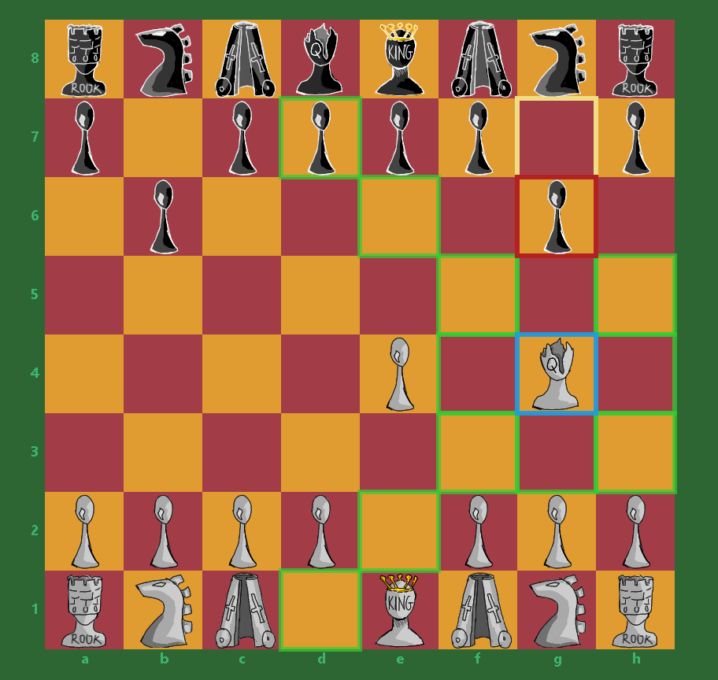
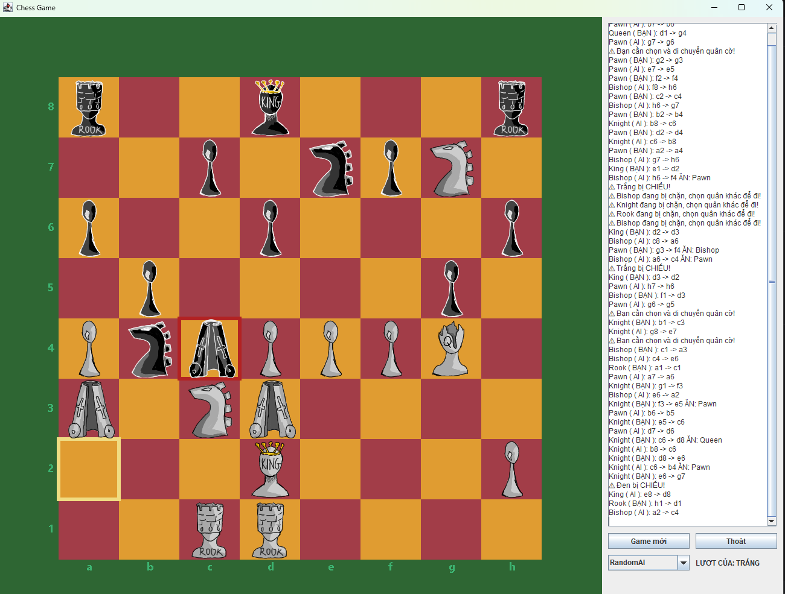

# ♟️ NMTTNT_CHESS – Game Cờ Vua AI - Java - Minimax & Alpha-Beta

## 1. Giới thiệu
NMTTNT_CHESS là dự án - đồ án môn học: game cờ vua (Java). 
Các thuật toán AI được cài đặt sát với engine cờ vua: Minimax, Alpha-Beta.
## 🖼 Giao diện & Cấu trúc dự án

<table align="center">
  <tr>
    <td align="center">
      <br>
      <i>Giao diện chính của trò chơi cờ vua</i>
    </td>
    <td align="center">
      <br>
      <i>Cấu trúc thư mục mã nguồn của dự án</i>
    </td>
  </tr>
</table>


---

## 2. Kiến trúc tổng thể

```
Main -> GameFrame -> GamePanel -> MouseHandler
                     |
                     v
               GameController
                     |
          -------------------------
          |           |           |
        Rules        AI        MoveLogger
```


<p align="center">
  
</p>

<p align="center">
  <i>Sơ đồ kiến trúc hệ thống (Diagram)</i>
</p>


## 3. Controller – Trung tâm điều phối

`GameController` là lớp trung tâm của hệ thống, chịu trách nhiệm:
- Quản lý lượt chơi (Trắng / Đen)
- Nhận nước đi từ người chơi
- Gọi AI đi nước tiếp theo
- Phát hiện: chiếu, chiếu bí, hòa
- Ghi nhận lịch sử nước đi

### Phát hiện hòa lặp 3 lần vị trí

Mỗi trạng thái bàn cờ được encode thành chuỗi và đếm số lần xuất hiện.

```java
private boolean detectRepetitionByPosition() {
    String key = encodeBoard(GamePanel.pieces, currentPlayer);
    int count = positionCount.getOrDefault(key, 0) + 1;
    positionCount.put(key, count);
    return count >= 3;
}
```

---

## 4. Rules – Sinh nước đi hợp lệ

Hàm `getLegalMoves()` sinh toàn bộ nước đi hợp lệ, loại bỏ:
- Tự chiếu
- Đi sai luật quân cờ
- Ăn vua

---


## 5. UI


| Class          | Vai trò |
|----------------|--------|
| GameFrame      | Cửa sổ chính |
| GamePanel      | Vẽ bàn cờ, quân cờ, highlight |
| ControlPanel   | Lịch sử nước đi, trạng thái |
| MouseHandler   | Bắt sự kiện chuột |
| MoveLogger     | Lưu lịch sử cho UI & AI |

### -Luồng xử lý UI

```
MouseHandler
     |
     v
GamePanel -----> GameController -----> AI
     |
     v
ControlPanel (MoveLogger)
```
### -GamePanel
- Vẽ bàn cờ 8x8
- Highlight:
  - Ô được chọn
  - Nước đi hợp lệ
  - Nước đi cuối (AI / người chơi)
- Vẽ tọa độ a–h, 1–8
- Gọi `GameController.onMove()` khi người chơi đi quân
<p align="center">
  
</p>

<p align="center">
  <i>Hightlight nước đi</i>
</p>

### -ControlPanel & MoveLogger
Hiển thị:
- Lượt chơi hiện tại
- Lịch sử nước đi
- Trạng thái AI

Ví dụ log:
```
Pawn (Bạn): e2 -> e4
Queen (AI): d8 -> f6
🤖 AI đang suy nghĩ...
```
<p align="center">
  
</p>

<p align="center">
  <i>Giao diện, ghi nước đi,..</i>
</p>


## 6. AI – Trí tuệ nhân tạo

### 6.1 SimpleAI
- Chọn ngẫu nhiên một nước đi hợp lệ
- Dùng cho demo và test hệ thống

### 6.2 MinimaxAI
- Áp dụng thuật toán Minimax
- Độ sâu tìm kiếm có thể cấu hình
- Đánh giá trạng thái bằng hàm heuristic

### 6.3 AlphaBetaAI
- Minimax + Alpha-Beta Pruning
- Cắt tỉa nhánh không cần thiết
- Hiệu năng tốt hơn rõ rệt so với Minimax thuần

---

